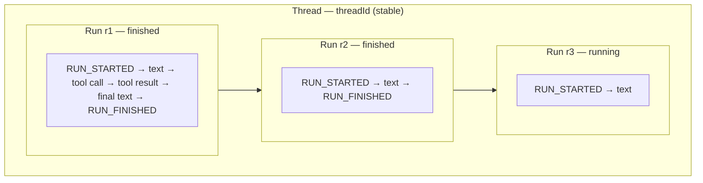

TanStack AI supports streaming responses for real-time chat experiences. Streaming allows you to display responses as they're generated, rather than waiting for the complete response.

## How Streaming Works

`chat()` returns an async iterable of spec AG-UI chunks. Branch on `chunk.type`:

```typescript
import { chat } from "@tanstack/ai";
import { openaiText } from "@tanstack/ai-openai";

const stream = chat({
  adapter: openaiText("gpt-5.5"),
  messages: [{ role: "user", content: "Hello!" }],
});

for await (const chunk of stream) {
  if (chunk.type === "TEXT_MESSAGE_CONTENT") {
    console.log(chunk.delta);
  }
  if (chunk.type === "RUN_FINISHED") {
    console.log(chunk.usage);
    console.log(chunk.metadata?.tanstack?.finishReason);
  }
}
```

## Server-Side Streaming

Convert the stream to an HTTP response using `toServerSentEventsResponse`:

```typescript
import { chat, toServerSentEventsResponse } from "@tanstack/ai";
import { openaiText } from "@tanstack/ai-openai";

export async function POST(request: Request) {
  const { messages } = await request.json();

  const stream = chat({
    adapter: openaiText("gpt-5.5"),
    messages,
  });

  // Convert to HTTP response with proper headers
  return toServerSentEventsResponse(stream);
}
```

## Client-Side Streaming

The `useChat` hook automatically handles streaming:

```typescript
import { useChat, fetchServerSentEvents } from "@tanstack/ai-react";

const { messages, sendMessage, isLoading } = useChat({
  connection: fetchServerSentEvents("/api/chat"),
});

// Messages update in real-time as chunks arrive
messages.forEach((message) => {
  // Message content updates incrementally
});
```

The shared `ChatClient` processes incoming chunks immediately and in order across every framework integration.

## Stream Events (AG-UI Protocol)

TanStack AI implements the [AG-UI Protocol](https://docs.ag-ui.com/introduction) for streaming. Stream events contain different types of data:

### AG-UI Events

Public `StreamChunk` follows AG-UI event types. TanStack extras live under `metadata.tanstack`.

| `chunk.type` | What you read |
| --- | --- |
| `RUN_STARTED` | `threadId`, `runId` |
| `TEXT_MESSAGE_START` / `CONTENT` / `END` | `messageId`, `delta` |
| `TOOL_CALL_START` / `ARGS` / `END` | `toolCallId`, `toolCallName`, args `delta`. Parsed input and output live on `UIMessage` parts |
| `REASONING_*` / `REASONING_ENCRYPTED_VALUE` | Thinking content. See [Thinking & Reasoning](./thinking-content) |
| `STEP_STARTED` / `STEP_FINISHED` | `stepName` only |
| `CUSTOM` | `name` and `value` (sandbox files, Code Mode, `structured-output.*`, `*.session-id`, and your `emitCustomEvent` calls). See [Custom Events](../protocol/custom-events) |
| `RUN_FINISHED` / `RUN_ERROR` | In-process `chat()` still uses TanStack `TokenUsage` (`promptTokens`). The SSE/HTTP wire uses the spec `usage` array (`inputTokens`). `finishReason` is `metadata.tanstack.finishReason`. Custom servers: see [Event metadata](../protocol/metadata) |

### Threads and runs

Two ids frame every stream, and they come from the AG-UI protocol itself — not
from any storage layer:

- A **thread** (`threadId`) is the conversation: the stable identity across
  every exchange, reload, and device.
- A **run** (`runId`) is one execution inside it: everything between one
  `RUN_STARTED` and its `RUN_FINISHED` (or `RUN_ERROR`). Every start mints a
  fresh run id, so a thread accumulates many runs over its life.

A run is not limited to a single model response. Tool calls and their
follow-up responses stream inside the same run — the whole
[agentic cycle](./agentic-cycle), however many loops it takes, is one run:



Because run ids are ephemeral, anything long-lived anchors on the thread:
[resumable streams](../resumable-streams/overview) log delivery per `runId`,
while [server persistence](../persistence/chat-persistence#threads-runs-and-turns)
stores the transcript per `threadId`. The media generation hooks take a
`threadId` too, where it names a slot rather than a conversation. See
[Id map](../persistence/id-map).

### Tool input and output

SSE and HTTP `TOOL_CALL_END` does not carry parsed `input`. In-process `chat()` still has `input`. Tool input and output also live on `UIMessage` parts. On the server, feed chunks into `StreamProcessor`. On the client, read `useChat` `messages`.

Server:

```typescript
import { chat, StreamProcessor, toolDefinition } from "@tanstack/ai";
import { openaiText } from "@tanstack/ai-openai";
import { z } from "zod";

const weatherTool = toolDefinition({
  name: "get_weather",
  description: "Get weather for a location",
  inputSchema: z.object({
    location: z.string(),
    unit: z.enum(["celsius", "fahrenheit"]).optional(),
  }),
});

const stream = chat({
  adapter: openaiText("gpt-5.5"),
  messages: [
    { role: "user", content: "What's the weather in Paris?" },
  ],
  tools: [weatherTool],
});

const processor = new StreamProcessor();
for await (const chunk of stream) {
  processor.processChunk(chunk);
}
processor.finalizeStream();

for (const message of processor.getMessages()) {
  for (const part of message.parts) {
    if (part.type === "tool-call") {
      console.log(part.name, part.input, part.output);
    }
  }
}
```

Client: pass your `.client()` tools to `useChat`. Checking `part.name` narrows `part.input` and `part.output`:

```typescript
import { useChat, fetchServerSentEvents } from "@tanstack/ai-react";
import { toolDefinition } from "@tanstack/ai";
import { z } from "zod";

const weatherTool = toolDefinition({
  name: "get_weather",
  description: "Get weather for a location",
  inputSchema: z.object({
    location: z.string(),
    unit: z.enum(["celsius", "fahrenheit"]).optional(),
  }),
}).client(async (input) => {
  return { location: input.location };
});

const { messages } = useChat({
  connection: fetchServerSentEvents("/api/chat"),
  tools: [weatherTool],
});

for (const message of messages) {
  for (const part of message.parts) {
    if (part.type === "tool-call" && part.name === "get_weather") {
      console.log(part.input?.location);
    }
  }
}
```

### Thinking Chunks

Thinking content comes from `REASONING_*` and `REASONING_ENCRYPTED_VALUE` events. `STEP_STARTED` and `STEP_FINISHED` only carry `stepName`. Read the `ThinkingPart` on `message.parts`:

```typescript
import { useChat, fetchServerSentEvents } from "@tanstack/ai-react";

const { messages } = useChat({
  connection: fetchServerSentEvents("/api/chat"),
});

for (const message of messages) {
  for (const part of message.parts) {
    if (part.type === "thinking") {
      console.log("Thinking:", part.content);
    }
  }
}
```

Thinking content is automatically converted to `ThinkingPart` in `UIMessage` objects. Unsigned thinking stays in the UI. Signed thinking is replayed to the model in original order. See [Thinking & Reasoning](./thinking-content) for the full rendering pattern.

## Connection Adapters

TanStack AI provides connection adapters for different streaming protocols:

### Server-Sent Events (SSE)

```typescript
import { useChat, fetchServerSentEvents } from "@tanstack/ai-react";

const { messages } = useChat({
  connection: fetchServerSentEvents("/api/chat"),
});
```

### HTTP Stream

```typescript
import { useChat, fetchHttpStream } from "@tanstack/ai-react";

const { messages } = useChat({
  connection: fetchHttpStream("/api/chat"),
});
```

### Custom Stream

For a fully custom request, use the `fetcher` transport. The fetcher receives the request input plus an `AbortSignal`, and returns a `Response` (whose SSE body the client parses) or an `AsyncIterable<StreamChunk>`. It may return that value synchronously, as a `Promise`, or as an `async function*`:

```typescript
import { useChat } from "@tanstack/ai-react";

const { messages } = useChat({
  fetcher: ({ messages, data }, { signal }) =>
    fetch("/api/chat", {
      method: "POST",
      body: JSON.stringify({ messages, ...data }),
      signal,
    }),
});
```

> **Note:** The lower-level `stream()` connection adapter takes a factory that must return an `AsyncIterable<StreamChunk>` **synchronously** (e.g. a generator) — it does not accept an `async (...) => {...}` function that returns a `Promise`. Prefer the `fetcher` transport above unless you specifically need the connection adapter.

## Monitoring Stream Progress

You can monitor stream progress with callbacks:

```typescript
import { useChat, fetchServerSentEvents } from "@tanstack/ai-react";

const { messages } = useChat({
  connection: fetchServerSentEvents("/api/chat"),
  onChunk: (chunk) => {
    console.log("Received chunk:", chunk);
  },
  onFinish: (message) => {
    console.log("Stream finished:", message);
  },
});
```

## Cancelling Streams

Cancel ongoing streams:

```typescript
import { useChat, fetchServerSentEvents } from "@tanstack/ai-react";

const { stop } = useChat({
  connection: fetchServerSentEvents("/api/chat"),
});

// Cancel the current stream
stop();
```

Calling `stop()` aborts the underlying fetch; the resulting `AbortError` is expected and normal. This differs from a connection being cut mid-line: a truncated stream throws a `StreamTruncatedError` and moves the client into its `error` state. See [Connection Adapters](./connection-adapters) for the underlying behavior.

On the server, pass an `AbortController` to `toServerSentEventsResponse(stream, { abortController })` so the chat run is cancelled when the client disconnects:

```typescript
import { chat, toServerSentEventsResponse } from "@tanstack/ai";
import { openaiText } from "@tanstack/ai-openai";

export async function POST(request: Request) {
  const { messages } = await request.json();
  const stream = chat({ adapter: openaiText("gpt-5.5"), messages });

  const abortController = new AbortController();
  return toServerSentEventsResponse(stream, { abortController });
}
```

## Queueing Messages

By default, calling `sendMessage` while a stream is already in flight **queues** the message instead of dropping it. It sends automatically once the current run settles **successfully**. Configure this with the `queue` option, which accepts any of three forms:

- a `QueueConfig` object
- a plain shorthand string
- a strategy function

```tsx group=queueing-messages
import { useChat, fetchServerSentEvents } from "@tanstack/ai-react";

const { messages, queue, sendMessage, cancelQueued, isLoading } = useChat({
  connection: fetchServerSentEvents("/api/chat"),
  queue: { whenBusy: "queue", drain: "fifo", maxSize: 5 },
});
```

- **`whenBusy`** — what happens to a send that arrives while the client is busy (streaming, claiming a send, or draining the queue):
  - `"queue"` (default) — hold the message; it sends once the run settles **successfully**. Clear the composer once the message appears in `queue` or `messages`.
  - `"drop"` — ignore the send (promise still resolves; does not throw). The message never appears in `queue` or `messages` — keep the composer text and show feedback if you want the user to retry.
  - `"interrupt"` — abort the current stream and send the new message immediately. Unlike `stop()`, this does **not** clear already-queued messages — they still drain after the interrupting send succeeds.
- **`drain`** — how queued items leave the queue: `"fifo"` (default) sends them one at a time in order; `"batch"` merges everything currently queued into a single send once the run settles successfully (string contents joined with `\n`, multimodal content concatenated in order; when sending via `ChatClient` with per-message `body`, the last item's `body` wins — framework hooks do not forward per-send `body`).
- **`maxSize`** — caps how many messages can be queued (`0` means never queue).
- **`onOverflow`** — `"reject"` (default) silently ignores a send once `maxSize` is reached (does not throw); `"drop-oldest"` evicts the oldest queued item to make room.

You can also pass a plain `WhenBusy` string (e.g. `queue: "interrupt"`) as shorthand for `{ whenBusy: "interrupt" }`, or a `QueueStrategy` function for per-send action control. Strategy form always drains FIFO (no `batch`); actions are `'queue' | 'drop' | 'interrupt'` (no concurrent streams). Per-call `whenBusy` overrides both config and strategy.

### When the queue drains vs flushes

- **Drain (auto-send)** — only after a **successful** stream settle (including after tool continuations finish).
- **Flush (discard without sending)** — on **error/abort of the active generation** (user `stop()`, real stream errors), `clear()`, `unsubscribe()`, and `reload()`. Interrupt aborts the old run without flushing; remaining items drain after a **successful** interrupting turn.
- **`interrupt` does not flush** — existing queued items remain and drain after the interrupting turn succeeds.

`useChat` exposes the pending queue as `queue` so you can render it distinctly from `messages`, along with `cancelQueued(id)` to cancel an item before it sends:

```tsx group=queueing-messages
function PendingQueue() {
  return (
    <>
      {queue.map((q) => (
        <div key={q.id} className="pending">
          {typeof q.content === "string" ? q.content : "[attachment]"}
          <button onClick={() => cancelQueued(q.id)}>Cancel</button>
        </div>
      ))}
    </>
  );
}
```

Override the configured policy for a single send with the second argument to `sendMessage`:

```tsx group=queueing-messages
sendMessage("Never mind, do this instead", { whenBusy: "interrupt" });
```

> **Note:** This is a default-behavior change — messages sent while streaming used to be silently dropped. They are now queued unless you opt into `queue: "drop"` (or `{ whenBusy: "drop" }`) to restore the old behavior, or `queue: "interrupt"`.

## Best Practices

1. **Handle loading states** - Use `isLoading` to show loading indicators
2. **Handle errors** - Check `error` state for stream failures
3. **Cancel on unmount** - Clean up streams when components unmount
4. **Optimize rendering** - Batch updates if needed for performance
5. **Show progress** - Display partial content as it streams
6. **Render queued messages distinctly** - Use `queue` to show pending sends separately from `messages`

## Next Steps

- [Connection Adapters](./connection-adapters) - Learn about different connection types
- [API Reference](../api/ai) - Explore streaming APIs
